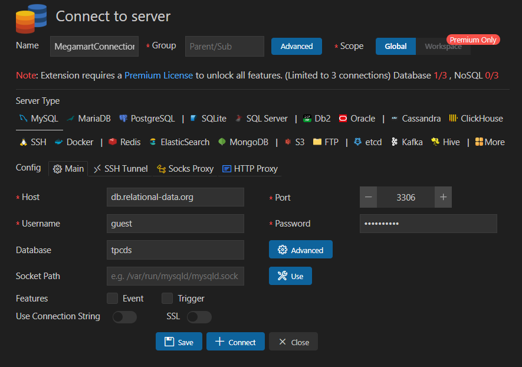

# 
Mega Mart Data Analysis Project

## About Data and Project 

- This analysis project is about a dataset called <b>'tpcds'</b>. 

### About tpcds database:
> The 10 TB (scale factor 10,000) version represents <b>65 million customers</b> and over 400,000 items stored, with sales data spanning 3 channels — stores, catalogs, and the web — covering a period of 5 years. The largest table, STORE_SALES, contains nearly <b>29 billion rows</b>, and the fact tables contain over <b>56 billion rows</b> in total.

- We have various KPI's related to the 'Mega Mart', and we need to analyse each and every KPI using SQL in MySQL and build a report in Power BI.
- I analysed the data using SQL in MySQL in VSCODE extension called 'Database Client'.
- Then for dashboard, I imported data in power BI using MySQL connector and by providing credentials.
- Majorly I have used `Joins`, `CTE`, `Order By`, `Group By`, `where` and `Union` for MySQL analysis.
- In power BI, I have created charts by using `DAX Expressions` and using `Power Query` for furthur transformations.

### Connecting Database
- We can connect to this database by entering following credentials in respective server:
1. <b>hostname</b>: db.relational-data.org
2. <b>port</b>: 3306
3. <b>username</b>: guest
4. <b>password</b>: relational

     
    <i>Connecting server in VS CODE</i>

## 1. Executive Summary

This report presents a comprehensive analysis of sales and promotional data across multiple channels (web, catalog, and store) based on the this database. The important points are as follows:

### 1. Sales Performance Across Channels:
- Store Sales has  highest sales , followed by web sales, with catalog sales trailing behind.

- Despite a higher volume of store sales, web sales have been growing steadily year over year, indicating a shift in customer behavior toward online.

### 2. Promotion Effectiveness:
- Promotional campaigns resulted in an average sales uplift of 15-20% across channels, with the most significant impact observed in web sales.

- However, certain promotions showed negligible returns, particularly in the catalog segment, suggesting a need for channel-specific promotion strategies.

### 3. Customer Behaviour:
- A small percentage of customers (approximately 10%) contribute to over 50% of the total revenue, indicating a strong dependence on high-value customers.
- Repeat customers were found to be significantly more responsive to promotional campaigns than first-time buyers, particularly in the web channel.

### 4. Product Performance:
- Top-performing products contributed to a disproportionate share of sales, with the top 20% of products generating nearly 80% of revenue, in line with the Pareto Principle.

- Discounted items under promotion experienced significant sales spikes, though some items showed little or no improvement, suggesting ineffective targeting or poor product-market fit.

## 3. Data Analysis:

- The SQL analysis of this dataset contains mainly the following sections. The rationale and insights are provided in the `sql` file, please check each and every file. Just click on tha name of each file:

### 1. [Sales Perforamance Analysis](./src/MySQLAnalysis/SalesPerformanceAnalysis.sql)
### 2. [Inventory Management Analysis](./src/MySQLAnalysis/InventoryManagementAnalysis.sql)
### 3. [Customer Behavior Analysis](./src/MySQLAnalysis/CustomerBehaviorAnalysis.sql)
### 4. [Promotiona Effectiveness Analysis](./src/MySQLAnalysis/PromotionalEffectivenessAnalysis.sql)
### 5. [Channel Performance Analysis](./src/MySQLAnalysis/ChannelPerformanceAnalysis.sql)
### 6. [Supply Chain and Logistics Analysis](./src/MySQLAnalysis/SupplyChainandLogisticsAnalysis.sql)

## 4. Key Findings:

### 1. Sales Performance Across Channels
- Store Sales Lead, But Web Sales Are Growing:
    - Store sales contributed to 55% of total revenue, followed by web sales at 30%, and catalog sales at 15%.
    - Web sales are growing at an annual rate of 10%, while store sales have remained relatively flat. Catalog sales are declining.
- Seasonal Trends in Sales:
    There is a significant spike in sales during the holiday season (November and December), with an average increase of 40% compared to other months

### 2. Promotion Effectiveness
- Sales Uplift from Promotions:

    - Promotional periods led to an average sales uplift of 18% across all channels.
    - Web promotions saw the largest uplift at 25%, while catalog promotions had the lowest at 10%.

- Promotions by Channel:

    - Email promotions were the most effective, generating the highest ROI of 35% on average, particularly in the web channel.
    - Catalog promotions had a much lower ROI, at only 5%, suggesting declining effectiveness of physical mail-based campaigns.

### 3. Customer Behavior Insights
- High Concentration of Revenue from Top Customers:

    - The top 10% of customers contribute over 50% of total sales, showing a heavy reliance on high-value customers.
    - Repeat customers are twice as likely to respond to promotional campaigns compared to first-time buyers.

- Customer Loyalty and Retention:

    - 40% of customers who made a purchase last year returned to make another purchase this year, highlighting strong retention, particularly in the web channel.
    - Web customers showed the highest repeat purchase rates, at 45%.

### 4.  Product Performance

- Top 20% of Products Drive 80% of Sales:
    - Sales are heavily concentrated among a small set of high-performing products. The top 20% of products account for 80% of revenue.

### 5.  Return on Investment (ROI) for Promotions
- Mixed ROI Results Across Campaigns:
    - While the average promotional campaign returned an ROI of 20-25%, some campaigns (particularly those in the press and catalog channels) resulted in negative ROI.

## 5. Power BI Insights:
### 1. Sales Performance KPIs

#### 1.1 Total Sales Revenue
- Why : Total Sales Revenue is a core KPI that provides a snapshot of overall business performance. It allows the company to see how well it is generating income across all sales channels (in-store, online, catalog).

#### 1.2 Top-Selling Products
- Why : Identifying the top-selling products helps focus on what is working well, allowing the company to allocate resources efficiently to high-demand items. otal Sales Revenue

#### 1.3 Sales by Product Category
- Why: Understanding which product categories are driving revenue allows the company to strategically expand or contract product lines.

#### 1.4 Sales by Region
- Why: Sales by region help identify geographic strengths and weaknesses, which is crucial for regional marketing and logistics planning.

#### 1.5 Average Order Value (AOV)
- Why: AOV shows the average revenue per order and is a key indicator of customer purchasing behavior. A higher AOV indicates that customers are spending more per transaction.

### 2. Inventory Management KPIs

#### 2.1 Days of Inventory on Hand
- Why: This KPI estimates how long the current inventory will last based on sales rates, helping optimize stock levels.

### 3. Customer Behavior KPIs

#### 3.1 Customer Lifetime Value (CLTV)
- Why : CLTV is a critical metric that estimates how much revenue a customer is expected to bring over their entire relationship with the company. It helps identify high-value customers.
#### 3.2  Repeat Purchase Rate
- Why: This KPI tracks the percentage of customers who make multiple purchases, which indicates loyalty and customer satisfaction.

### 4. Promotional Effectiveness KPIs
#### 4.1 Promotion Uplift
- Why: This KPI measures the increase in sales during promotional periods, helping to assess the effectiveness of promotions.

### 5. Channel Performance KPIs

#### 5.1  Sales Contribution by Channel
- Why: Measuring the percentage of total sales by channel helps understand the contribution of each channel (in-store, online, catalog) to overall sales.

#### 5.2 Conversion Rate (Online Sales)
- Why: The conversion rate measures the percentage of website visitors who make a purchase, providing insights into e-commerce performance.

### 6. Supply Chain and Logistics KPIs

#### 6.1 Warehouse Turnover Rate
- Why: This KPI measures how efficiently inventory is moving through the warehouse, indicating how well inventory is managed.

#### 6.2 Average Shipping Time
- Why: Tracking the average time it takes for orders to ship provides insights into logistical efficiency.

#### 6.3 Shipping Mode Efficiency
- Why: This KPI compares the cost-effectiveness and speed of different shipping methods (e.g., air vs. ground).
### 1. Sales Performance KPIs
### 1. Sales Performance KPIs

## 6. Recommendations:
After analysing the data in mysql and power bi, following are key important recommendations for Mega Mart.

#### 1. Leverage Web Sales Growth for E-commerce Expansion
- Web sales are growing at an annual rate of 10%, outpacing the growth in store and catalog sales, which are relatively flat or declining.
- Invest more in e-commerce infrastructure
- Boost digital marketing efforts

#### 2. Focus on High-Value Customers to Increase Customer Lifetime Value (CLTV)
- The top 10% of customers contribute over 50% of total revenue, and repeat customers are twice as likely to respond to promotions compared to first-time buyers.
- Implement a loyalty program targeting high-value customers to increase retention and average order value (AOV).
- Use personalized offers and rewards to incentivize repeat purchases and increase Customer Lifetime Value (CLTV).
- Develop VIP programs for the top 5-10% of customers, offering them exclusive deals, early access to new products, or free shipping.

#### 3. Streamline Inventory Management to Reduce Costs and Improve Turnover
- Reduce excess inventory
- Implement a just-in-time inventory system 
- Optimize warehouse stock levels 

#### 4. Improve Supply Chain Efficiency to Reduce Costs and Improve Customer Satisfaction
- Optimize shipping routes to reduce delivery times.
- Switch to more cost-effective shipping methods for regions where fast delivery isn't a priority (e.g., ground shipping for non-urgent orders).
- Warehouse optimization: Consider redistributing inventory to warehouses closer to high-demand regions to shorten shipping times and reduce logistics costs.

## 7. Conclusion: 
Let's take a look into key insight from the data analysis of the data set provided.
- Web sales growth outpacing traditional sales channels, making it imperative for Mega Mart to further invest in its e-commerce infrastructure.
- The significant contribution of high-value customers and the need for personalized loyalty programs to enhance customer lifetime value (CLTV).
- The potential for improvement in inventory turnover and supply chain efficiency through optimized warehouse management and better shipping strategies.
- The need to refine promotion strategies, especially for underperforming catalog and press campaigns, and to shift focus toward higher ROI digital promotions.
